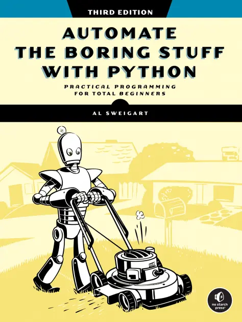
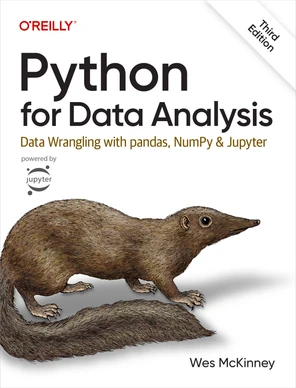

# Introduction to programming, with Python

Sources and references for the course.

- [Introduction to programming, with Python](#introduction-to-programming-with-python)
  - [Course materials](#course-materials)
  - [Mini labs (commented source code)](#mini-labs-commented-source-code)
  - [Problems and suggestions](#problems-and-suggestions)
  - [References](#references)
    - [Tools](#tools)
    - [Bibliography](#bibliography)
    - [On the web](#on-the-web)

## Course materials

[Access course materials (HTML)](https://ftp.pschuhmacher.com/introduction-to-programming/)

## Mini labs (commented source code)

[See sources](./mini-labs/)

## Problems and suggestions

## References

### Tools

- [PyCharm IDE](https://www.jetbrains.com/pycharm/), Community Version

### Bibliography

> Pick one that "fits" you and use it.

- [Python Crash Course, 3rd Edition: A Hands-On, Project-Based Introduction to Programming](https://nostarch.com/python-crash-course-3rd-edition), by Eric Matthes, 2022, published by No Starch Press. To learn how to program with Python
- [Automate the Boring Stuff with Python, 3rd Edition: Practical Programming for Total Beginners](https://automatetheboringstuff.com/), by Al Sweigart, 2025, published by No Starch Press. **Free web version**. To learn how to program with Python
- [Introduction to Computation and Programming Using Python with Application to Computational Modeling and Understanding Data](https://mitpress.mit.edu/9780262542364/introduction-to-computation-and-programming-using-python/), 3rd Edition, by John V. Guttag, 2021, published by The MIT Press. To learn how to program with Python
- [Python for Data Analysis: Data Wrangling With Pandas, Numpy, and Jupyter](https://www.oreilly.com/library/view/python-for-data/9781098104023/), by Wes McKinneyn, 2022, published by O'Reilly Media. To master data manipulation and visualisation with most used libraries

### On the web

- [Awesome Python](https://awesome-python.com/), an opinionated guide to the best Python frameworks, libraries, and tools.
